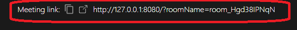
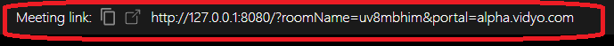

# Migrating from Twilio Javascript API to VidyoClient Javascript API
This application is designed as a migration guide to help users transition their existing Twilio Video implementation to VidyoClient SDK.

We have developed a basic video chat application that seamlessly switches between Twilio and VidyoClient SDKs for flexibility. Users simply set an environment variable to choose their preferred SDK. The code is meticulously structured with corresponding Twilio and VidyoClient versions for each function and UI operation. To streamline testing, the application runs locally, and you can simulate multiple users using different browser tabs.

The application supports the following features:
* allows multiple  (> 2) participants, whose video tiles are automatically displayed in the UX as they join/leave a call
* supports screen sharing
* enumerate attached cameras, microphones and speakers & allow users to select the device to use
* allow users to turn on/off their camera, microphone or speaker

## Running the Application using Twilio SDK

Twilio Video API requires  API keys for authentication.
 
### Twilio api keys
<strong>Copy the `env.template` file into a `.env` file and enter your twilio keys</strong>
 
* `TWILIO_ACCOUNT_SID` - from https://console.twilio.com/
* `TWILIO_API_KEY_SID` and `TWILIO_API_KEY_SECRET`- from https://console.twilio.com/us1/account/keys-credentials/api-keys
* set `CLIENT_PROVIDER=TWILIO` in the `.env` file

### Run
* `npm i`
* `npm run build`
* `npm start`
* open http://127.0.0.1:8080/ in browser
* Click on the call button to create a rooom and enter it. 
* A `meeting link` is generated and displayed in the UX. Other users can join the room by opening the meeting link in a new tab.
  
  
  

## Running the Application using VidyoClient SDK
To run the application using the VidyoPlatform, you will need a VidyoPlatform account.
### Create a VidyoPlatform trial account
Create a trial account with VidyoPlatform  at  https://www.vidyo.com/develop-video-app-platform. The account setup process will explain how you can create meeting rooms and generate meeting links to invite other users to join. 

### Building the application
<strong>copy the `env.template` file into a `.env` file </strong>

* set `CLIENT_PROVIDER=VIDYO` in the `.env` file

### Run
* `npm i`
* `npm run build`
* `npm start`

then open http://127.0.0.1:8080/ in browser

### Join room 
* Enter the *portal* and *roomName* fields for the room you have created in your Vidyo account
* Clicking on the call button to join the room. 
* A `meeting link` is generated and displayed in the UX. Other users can join the room by opening the meeting link in a new tab.

